# Milestone project 1 - B 4 Flames - A Fictional band website.

This first milestone project for the Full Stack Web Developer course was intended to test my knowledge of both HTML5 and CSS3 by giving a brief to follow and implement using the 
aforementioned languages. This project will also strive to follow a mobile first approach to ensure the site will remain functional and engaging on a range of platforms from mobile 
devices through to desktops. 

The brief for the project gave three options for consideration, to design a portfolio website to show off to potential employers, to create a band website, or to design something of 
our own that will still enable all the module criteria to be fulfilled. As such I elected to focus on a fictional rock band and their desire to create a website that will further their 
career by bringing together fans of the band through various interactions and sharing of information.
 
## UX
 
The design of the website will consider three particular groups. Firstly the band, with their objective to increase their online presence and provide a place for fans to find as 
much information about the band and allow them to engage, both with the band themselves and other fans. 

The second group for consideration would be current fans. As they would likely already know some information about the band their primary focus would be to engage with the band and 
other fans to create a sense of community, and to find out information about tour dates, where they can find the band, and where to purchase tickets.

Finally, the last group for consideration would be new fans. These are likely to be people that have heard about the band by word of mouth, media coverage or possibly search engine results. 
As such they are likely to want to find out more information about the band and access different media to see if they would like to become more involved with the band.

With these considerations in mind it was important to plan accordingly.

- All users; were likely to rock music enthusiasts and so would expect a certain aesthetic, as such I chose a colour scheme of black, red, yellow and orange. This also tied in with the
name of the fictional band.

- All users; would want an easily navigable site that was fairly intuitive to use. I elected to tackle this with three main areas for navigation. A responsive navbar at the top of the 
page with links to the various pages of the site, that would collapse to a tripple bar button that could be clicked on mobile view to expand and show the links. The footer containing 
social media buttons with links off-site to the various platforms located at the bottom of the page. And finally, a responsive sidebar with jump links to content contained within the 
page to make finding information easy without having to scroll through the entire page.

- Current fans; would likely want to find other fans of the band to communicate with, as well as the band themselves. This led to the design of all pages having a social media footer 
at the bottom of the page to allow easy and quick access. Though the links are in place and working, as the band is fictional they only link to default social media platform pages rather 
than a unique page.

- Current fans and potential fans; are likely to want to know when they will be able to see the band live, so a tour page was created with dates and links to venues where they could 
purchase tickets. To do this I envisioned a European tour and devised a route through several countries, researching potential venues for this style of band.

- Potential fans; primary goal would be to find more information regarding the band. To this end an "About" page was created with some biographical information for each band member, as 
well as a "Media" page where they could access various images and music. To achieve this goal I found some stock photos for an image accordion, embeded a simple audio player with stock 
music, and inserted a youtube video of a rock band.

Below can be found the simple wireframe structure for the individual pages for both desktop and mobile views:

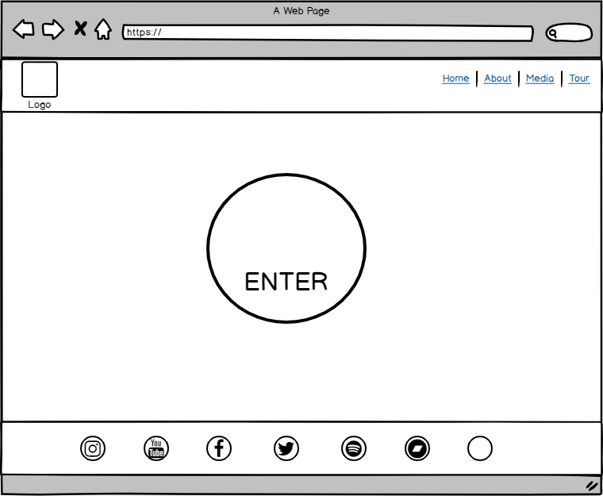

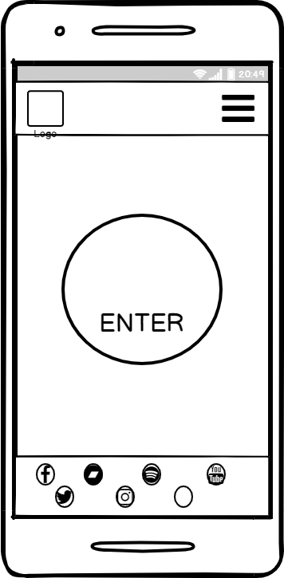

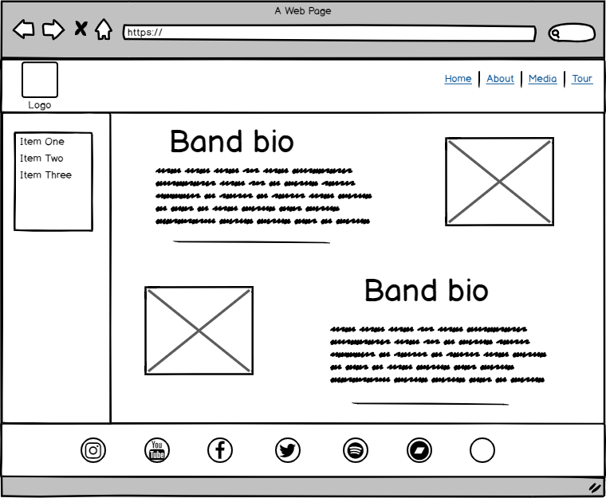

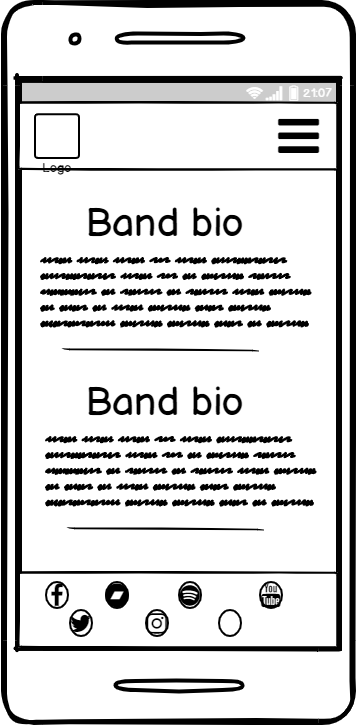

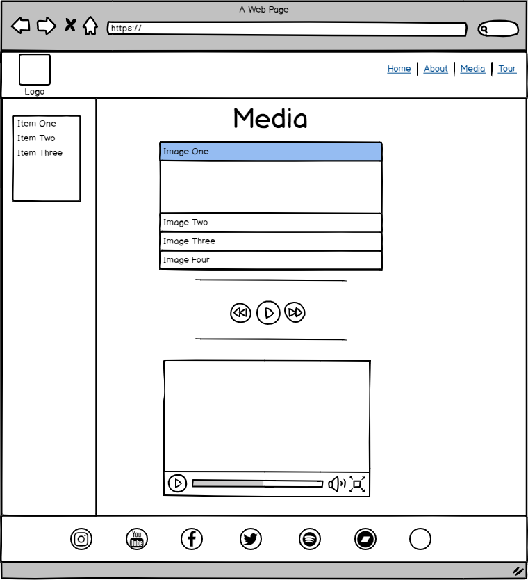

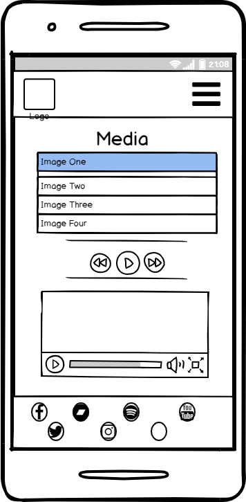

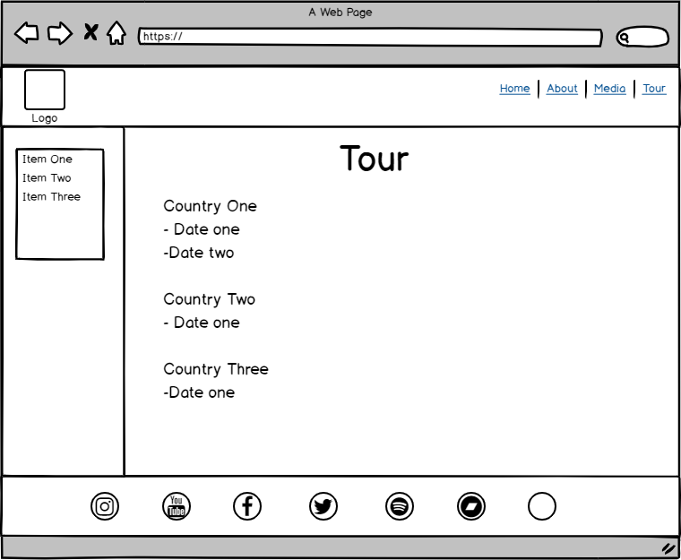

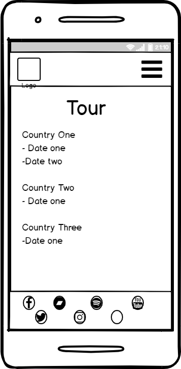

## Features

1. Index page - a landing page to grab the attention and entice the user into delving deeper into the site.
2. About page - a biography page to learn more about the members.
3. Media page - a page containing the various media for users to make use of.
4. Tour page - a page listing the forthcoming tour dates for the band.
 
### Existing Features

- Responsive navbar, allows users to have similar experience on all devices and have familiarity when navigating through the site.
- Responsive sidebar, scaling with screen sizes between tablet and desktop. Not enabled for mobile viewing as it would be too squashed and take up too much screen realestate.
- Jump links on sidebar to allow users to quickly navigate to different content within each individual page.
- Social media footer, allowing users on all devices quick access to social media platforms.
- On hover colour changes for all links on the site to allow users some interactivity with links. Social media links also change to the colours associated with the various 
platforms.
- Image accordion to easily access several images within a smaller space. Allows all images to be contained to limit taking up too much screen space and limit having to scroll 
through the page.
- Audio button to listen to the "latest track" on the website itself, mostly for new fans/users of the site to tempt them into listening to more media via the social media 
platforms.
- Embedded video, enabling users to view the latest video uploaded on the website, also available in fullscreen. Again, more for newer users of the site to tempt them to engaging 
more with the band social media platforms.
- Tour dates with venue specific details and links, allowing users to view the addresses and to click to view the venue's site and purchase tickets.

### Future revisions

- Mailing list, to allow users to sign up via a form to join a mailing list to be informed of upcoming tours, media and mechandise.
- Merchandise page to allow fans to purchase band merchandise from the website directly.
- Message board/chat page, to allow fans to communicate directly with one another, possibly to set up band Q & A sessions etc.

## Technologies Used

During the design of the site the following technologies were used to achieve this:

- HTML5 - provided the content and structure, care was taken to strive to use semantic elements where possible to adhere to best practices of web design.
- CSS3 - provided the customisation and styling to the pages.
- [Bootstrap](https://getbootstrap.com/) - allowed me to use a framework to achieve both styling and functionality. The Bootstrap classes were used to create a sidebar and make it sticky 
when scrolling as well as creating a responsive navbar.
- [JQuery/Javascript](https://jquery.com) - Bootstrap required an imported version of JQuery to enable the functionality of the responsive navbar, without which it was unable to function.
- Google fonts - were used to add more unique and stylish fonts rather than default ones to provide a better user experience.
- Font Awesome - added some further styling by providing some unique icons to further enhance the user experience.
- Gitpod - was the chosen IDE to use for creating the website as it links well with the technologies for hosting, storing and version management and is available through a browser extension.
- Git - was used for version control to allow constant updating and rollbacks if/when required.
- GitHub - was the chosen to store the repositories as it dovetails well with Git and Gitpod, as well as having the option to host a live version of the site once completed.
## Testing

Whilst the development of the site has been predominently done in Chrome with extensive utilisation of the devtools therein to test the functionality of the site at different screen 
sizes and to find problem areas of code which weren't behaving as intended, there has also been periodic testing on Firefox, Opera, Internet Explorer and Edge, and with the exception 
of IE appears to function as intended on all of them. The issue found on IE is a problem with the sidebar not behaving as a sticky object and remaining at the top of the screen whilst 
scrolling through the pages. Some research has led me to find that this functionality is not supported in this browser, though as of writing I have been unable to find a work-around 
for this particular issue, though it may be possible to remedy this with further revisions.

Once the site was near completion I also ran the code through an online validator [Freeformatter](https://www.freeformatter.com/) to ensure the code was correct and adhered to the correct 
standards. There were only two of the pages that flagged up any errors, results of which can be seen in the below images:

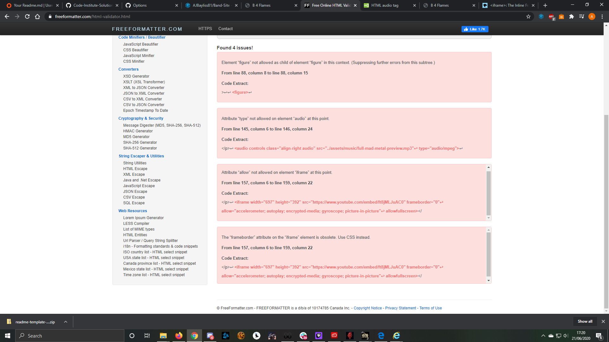

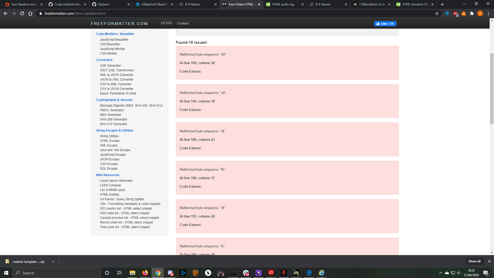

For the media page I was able to address the majority of the issues with the exception of the first <figure> error. The code for this image accordion was copied from online to use with 
the purpose of saving space for a gallery, and though I did attempt to fix the code to address this particular issue I was unable to satisfactorily resolve this prior to submission. As 
such the code was reverted, though future revisions will attempt to address this. The screen shot below shows that all other issues flagged were addressed and resolved without impacting 
on the functionality of the site.

The issues flagged up on the tour site seem to refer to the different accents on the letters used from the various European languages. As such, I elected to keep these as they were to 
ensure that the addresses of the venues remained as written in the native languages.

Here is the screenshot showing the results after debugging the code for the media.html page:

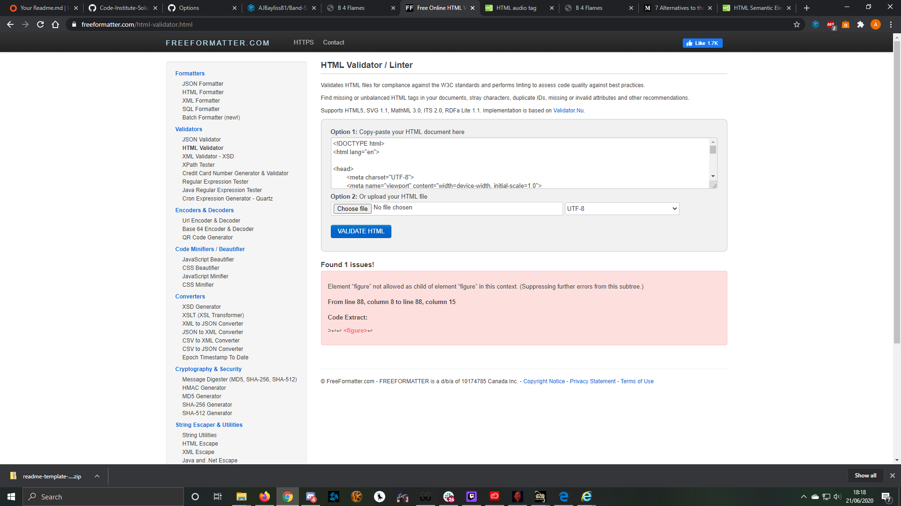
## Deployment

As the repository was stored and developed with the tools available through the Git technologies (Git, GitHub and Gitpod) the steps to deploy the website were relatively easy.
1. Firstly logging into GitHub took me to my dashboard.
2. From here I clicked on the link to the band website titled "Band-Site".
3. I then clicked on the "settings" button on the far right of the menu bar beneath the repository name.
4. The penultimate section when scrolling down is titled "GitHub Pages", with the first option available being "source".
5. Upon selecting the master branch from the dropdown menu the site was made live and a link generated.
6. The live site can be found [here](https://ajbayliss81.github.io/Band-Site/)

There are no different configurations, separate Git branches or differences of any kind between the deployed version and the development version.

If you wish to run the code locally then this is possible using the following steps:
1. Navigate to the repository [here](https://github.com/AJBayliss81/Band-Site).
2. From there a green button called "Clone or download" can be found to the right, prior to the list of files and click to show the options for copying to clipboard or saving to the 
device.
3. Click the grey clipboard icon to copy the URL to the clipboard.
4. Open a bash terminal in your desired software and navigate to the desired repository.
5. Type the command "git clone" into the terminal and paste the link,

## Credits

### Content
- The code for the image accordion used for the media section was found [here](https://tympanus.net/codrops/2012/06/06/image-accordion-with-css3/) - Rey Wang.

### Media
#### Images
- The photos used in this site were obtained from:
- band-main.jpg - Photo by Sean on Unsplash
- flames.jpg - Photo by Daphne on Unsplash
- microphone.jpg - Image by Nachrichten_muc from Pixabay
- drums.jpg - Image by tonischerrenberg from Pixabay
- guitar1.jpg - Image by Wolfgang Claussen from Pixabay
- bass-guitar.jpg - Image by charlie0111 from Pixabay
- band-studio.jpg - Photo by Hans Vivek on Unsplash
- solo-guitar.jpg - Photo by Timothy Eberly on Unsplash
- bw-band.jpg - Photo by Glenn van de Wiel on Unsplash
- 3-band.jpg - Photo by Frankie Cordoba on Unsplash
- distant-band.jpg - Photo by bantersnaps on Unsplash
- crowd.jpg - Photo by Joshua Davis on Unsplash
- outward-band.jpg - Photo by Denisse Leon on Unsplash
- hands-rasied.jpg - Photo by Jamieson Murphy on Unsplash
- bassist.jpg - Photo by Frankie Cordoba on Unsplash
- venue.jpg - Photo by Jay Wennington on Unsplash
#### Audio
- full-mad-metal-preview.mp3 - black rhomb on premiumbeat.com

### Acknowledgements

- [Reuben Ferrante](https://github.com/arex18) - my mentor, for giving guidance and useful tools to utilise along the way to developing the project.
- [W3Schools](https://www.w3schools.com/) - was used extensively throughout the project for insights into resolving various issues and finding different methods to tackling problems.
- [Balsamiq](https://balsamiq.com/) - for an easy to use and flexible wireframe tool for making planning the site simple and straightforward.
- [AI](https://www.adobe.com/uk/products/illustrator.html?gclid=CjwKCAjwrcH3BRApEiwAxjdPTU6o3rhJ81c6S_16P3D1B_oAQnTmaZJ2FdA5UNXa8WXadNVi5LK-yBoCO9MQAvD_BwE&sdid=88X75SKR&mv=search&ef_id=CjwKCAjwrcH3BRApEiwAxjdPTU6o3rhJ81c6S_16P3D1B_oAQnTmaZJ2FdA5UNXa8WXadNVi5LK-yBoCO9MQAvD_BwE:G:s&s_kwcid=AL!3085!3!441664373979!e!!) - 
Adobe Illustrator for a relatively simple to use package enabling me to design an effective logo with little experience in a short time. 
- 
