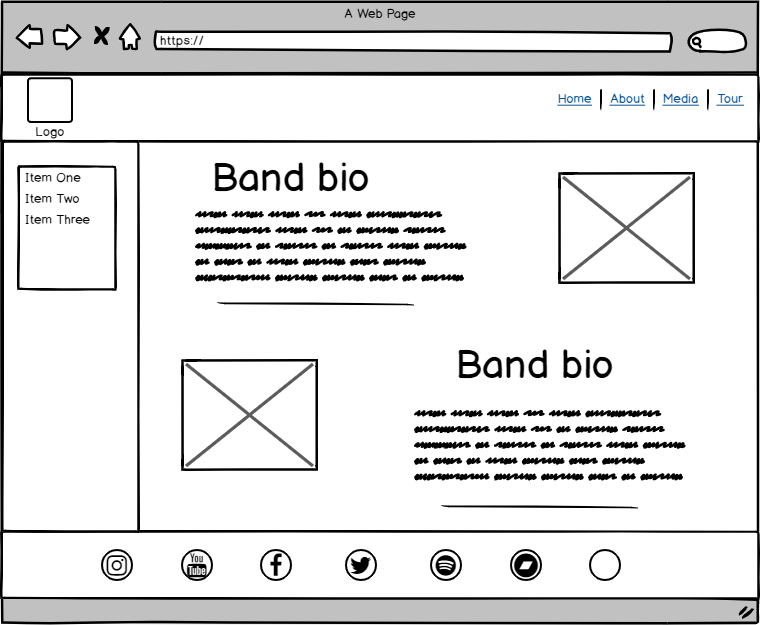
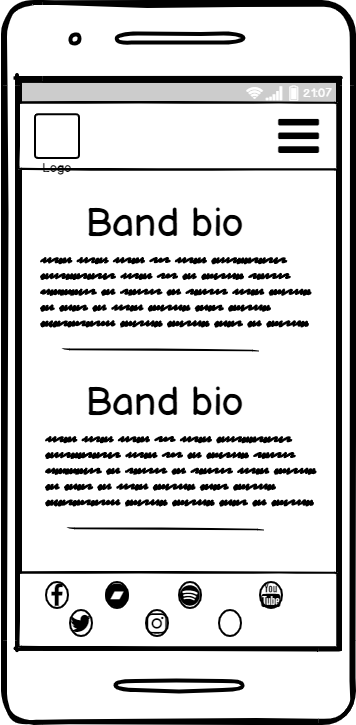
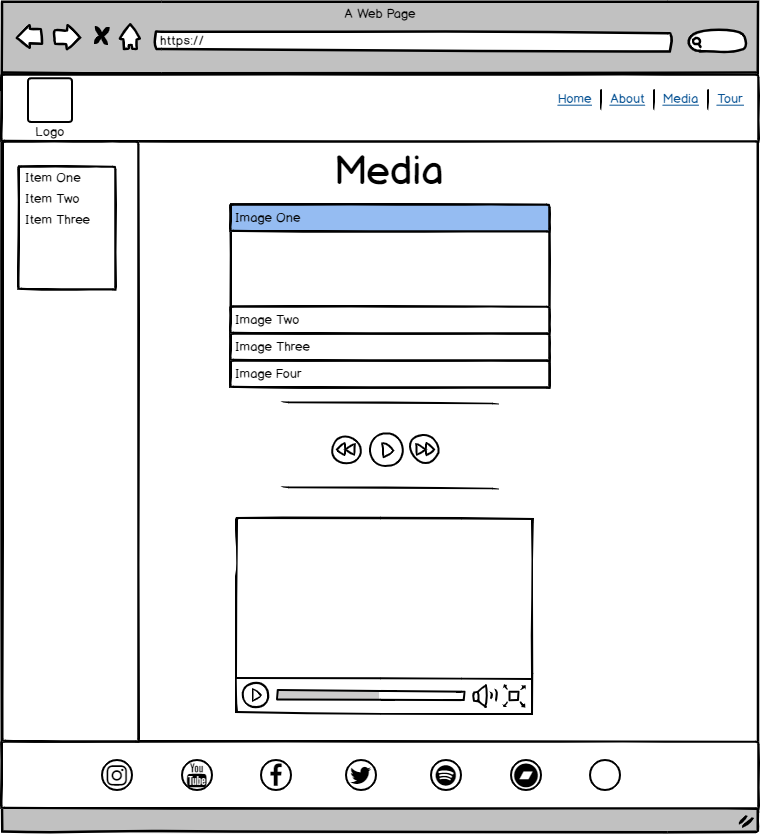
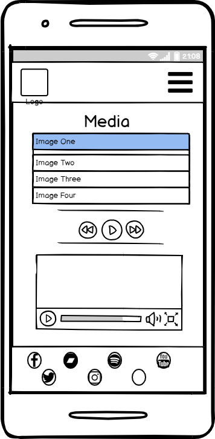

# Milestone project 1 - B 4 Flames - A Fictional band website.

This first milestone project for the Full Stack Web Developer course was intended to test my knowledge of both HTML5 and CSS3 by giving a brief to follow and implement using the 
aforementioned languages. This project will also strive to follow a mobile first approach to ensure the site will remain functional and engaging on a range of platforms from mobile 
devices through to desktops. 

The brief for the project gave three options for consideration, to design a portfolio website to show off to potential employers, to create a band website, or to design something of 
our own that will still enable all the module criteria to be fulfilled. As such I elected to focus on a fictional rock band and their desire to create a website that will further their 
career by bringing together fans of the band through various interactions and sharing of information.
 
## UX
 
The design of the website will consider three particular groups. Firstly the band, with their objective to increase their online presence and provide a place for fans to find as 
much information about the band and allow them to engage, both with the band themselves and other fans. 

The second group for consideration would be current fans. As they would likely already know some information about the band their primary focus would be to engage with the band and 
other fans to create a sense of community, and to find out information about tour dates, where they can find the band, and where to purchase tickets.

Finally, the last group for consideration would be new fans. These are likely to be people that have heard about the band by word of mouth, media coverage or possibly search engine results. 
As such they are likely to want to find out more information about the band and access different media to see if they would like to become more involved with the band.

With these considerations in mind it was important to plan accordingly.

- All users; were likely to rock music enthusiasts and so would expect a certain aesthetic, as such I chose a colour scheme of black, red, yellow and orange. This also tied in with the
name of the fictional band.

- All users; would want an easily navigable site that was fairly intuitive to use. I elected to tackle this with three main areas for navigation. A responsive navbar at the top of the 
page with links to the various pages of the site, that would collapse to a tripple bar button that could be clicked on mobile view to expand and show the links. The footer containing 
social media buttons with links off-site to the various platforms located at the bottom of the page. And finally, a responsive sidebar with jump links to content contained within the 
page to make finding information easy without having to scroll through the entire page.

- Current fans; would likely want to find other fans of the band to communicate with, as well as the band themselves. This led to the design of all pages having a social media footer 
at the bottom of the page to allow easy and quick access. Though the links are in place and working, as the band is fictional they only link to default social media platform pages rather 
than a unique page.

- Current fans and potential fans; are likely to want to know when they will be able to see the band live, so a tour page was created with dates and links to venues where they could 
purchase tickets. To do this I envisioned a European tour and devised a route through several countries, researching potential venues for this style of band.

- Potential fans; primary goal would be to find more information regarding the band. To this end an "About" page was created with some biographical information for each band member, as 
well as a "Media" page where they could access various images and music. To achieve this goal I found some stock photos for an image accordion, embeded a simple audio player with stock 
music, and inserted a youtube video of a rock band.

Below can be found the simple wireframe structure for the individual pages for both desktop and mobile views:

## Features

1. Index page - a landing page to grab the attention and entice the user into delving deeper into the site.
2. About page - a biography page to learn more about the members.
3. Media page - a page containing the various media for users to make use of.
4. Tour page - a page listing the forthcoming tour dates for the band.
 
### Existing Features

- Responsive navbar, allows users to have similar experience on all devices and have familiarity when navigating through the site.
- Responsive sidebar, scaling with screen sizes between tablet and desktop. Not enabled for mobile viewing as it would be too squashed and take up too much screen realestate.
- Jump links on sidebar to allow users to quickly navigate to different content within each individual page.
- Social media footer, allowing users on all devices quick access to social media platforms.
- On hover colour changes for all links on the site to allow users some interactivity with links. Social media links also change to the colours associated with the various 
platforms.
- Image accordion to easily access several images within a smaller space. Allows all images to be contained to limit taking up too much screen space and limit having to scroll 
through the page.
- Audio button to listen to the "latest track" on the website itself, mostly for new fans/users of the site to tempt them into listening to more media via the social media 
platforms.
- Embedded video, enabling users to view the latest video uploaded on the website, also available in fullscreen. Again, more for newer users of the site to tempt them to engaging 
more with the band social media platforms.
- Tour dates with venue specific details and links, allowing users to view the addresses and to click to view the venue's site and purchase tickets.

### Future revisions

- Mailing list, to allow users to sign up via a form to join a mailing list to be informed of upcoming tours, media and mechandise.
- Merchandise page to allow fans to purchase band merchandise from the website directly.
- Message board/chat page, to allow fans to communicate directly with one another, possibly to set up band Q & A sessions etc.

## Technologies Used

During the design of the site the following technologies were used to achieve this:

- HTML5 - provided the content and structure, care was taken to strive to use semantic elements where possible to adhere to best practices of web design.
- CSS3 - provided the customisation and styling to the pages.
- [Bootstrap](https://getbootstrap.com/) - allowed me to use a framework to achieve both styling and functionality. The Bootstrap classes were used to create a sidebar and make it sticky 
when scrolling as well as creating a responsive navbar.
- [JQuery/Javascript](https://jquery.com) - Bootstrap required an imported version of JQuery to enable the functionality of the responsive navbar, without which it was unable to function.

    - The project uses **JQuery** to simplify DOM manipulation.

## Testing

In this section, you need to convince the assessor that you have conducted enough testing to legitimately believe that the site works well. Essentially, in this part you will want to go over all of your user stories from the UX section and ensure that they all work as intended, with the project providing an easy and straightforward way for the users to achieve their goals.

Whenever it is feasible, prefer to automate your tests, and if you've done so, provide a brief explanation of your approach, link to the test file(s) and explain how to run them.

For any scenarios that have not been automated, test the user stories manually and provide as much detail as is relevant. A particularly useful form for describing your testing process is via scenarios, such as:

1. Contact form:
    1. Go to the "Contact Us" page
    2. Try to submit the empty form and verify that an error message about the required fields appears
    3. Try to submit the form with an invalid email address and verify that a relevant error message appears
    4. Try to submit the form with all inputs valid and verify that a success message appears.

In addition, you should mention in this section how your project looks and works on different browsers and screen sizes.

You should also mention in this section any interesting bugs or problems you discovered during your testing, even if you haven't addressed them yet.

If this section grows too long, you may want to split it off into a separate file and link to it from here.

## Deployment

This section should describe the process you went through to deploy the project to a hosting platform (e.g. GitHub Pages or Heroku).

In particular, you should provide all details of the differences between the deployed version and the development version, if any, including:
- Different values for environment variables (Heroku Config Vars)?
- Different configuration files?
- Separate git branch?

In addition, if it is not obvious, you should also describe how to run your code locally.

## Credits

### Content
- The text for section Y was copied from the [Wikipedia article Z](https://en.wikipedia.org/wiki/Z)

### Media
- The photos used in this site were obtained from ...

### Acknowledgements

- I received inspiration for this project from X
